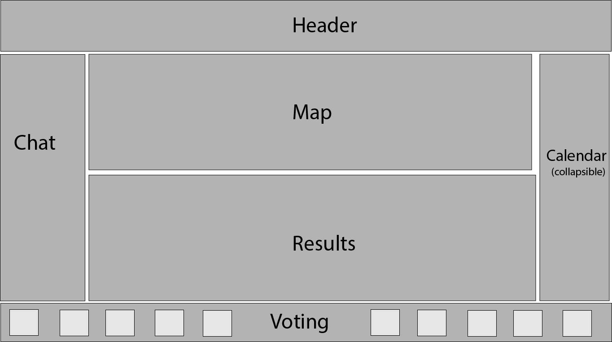
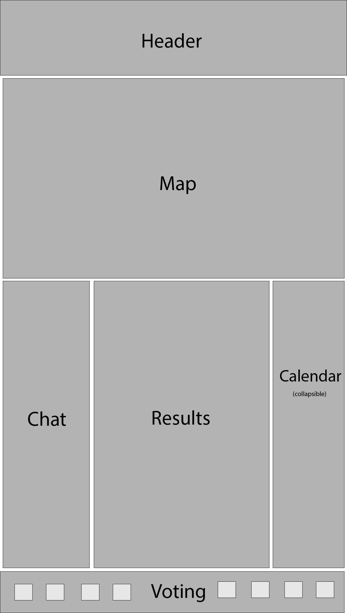

# Project_1

Project Title: Social Movie Scheduler

Team Members: Danielle Doty, Alicia Collins, Jason Forman

Project Description:  A movie scheduler app for friends to figure out when/where/what they can go see.  The app allows you to put in what times you are available and, based on geolocation, will tell you the best theatre and times.  We plan to impliment a chat function and vote ranking for movies to decide which movie to see.  Firebase will store the results.

Rough Sketch: 

Mobile Sketch:

APIs:  Fandango, OMDB/Rotten Tomatoes, Google Maps, Firebase, MessageAPI(or some other chat API).

Tasks: Create Interface, mobile first thought process. Integrate google maps into interface.  Integrate Fandango API to pull theatre and time data.  Integrate OMDB/Rotten Tomatoes for movie data.  Implement voting system and push/pull to Firebase.  Create calendar interface to allow available times to be selected.

After MVP:
Allow favorites to be saved locally/remotely.
Pull Google Calendar into app to allow easier viewing of available times.
Allow voting of theaters or allow app to select best theatre based on location. 
Fly out module for movie information.
Allow other social scheduling events (restaurants, study sessions, etc.)
